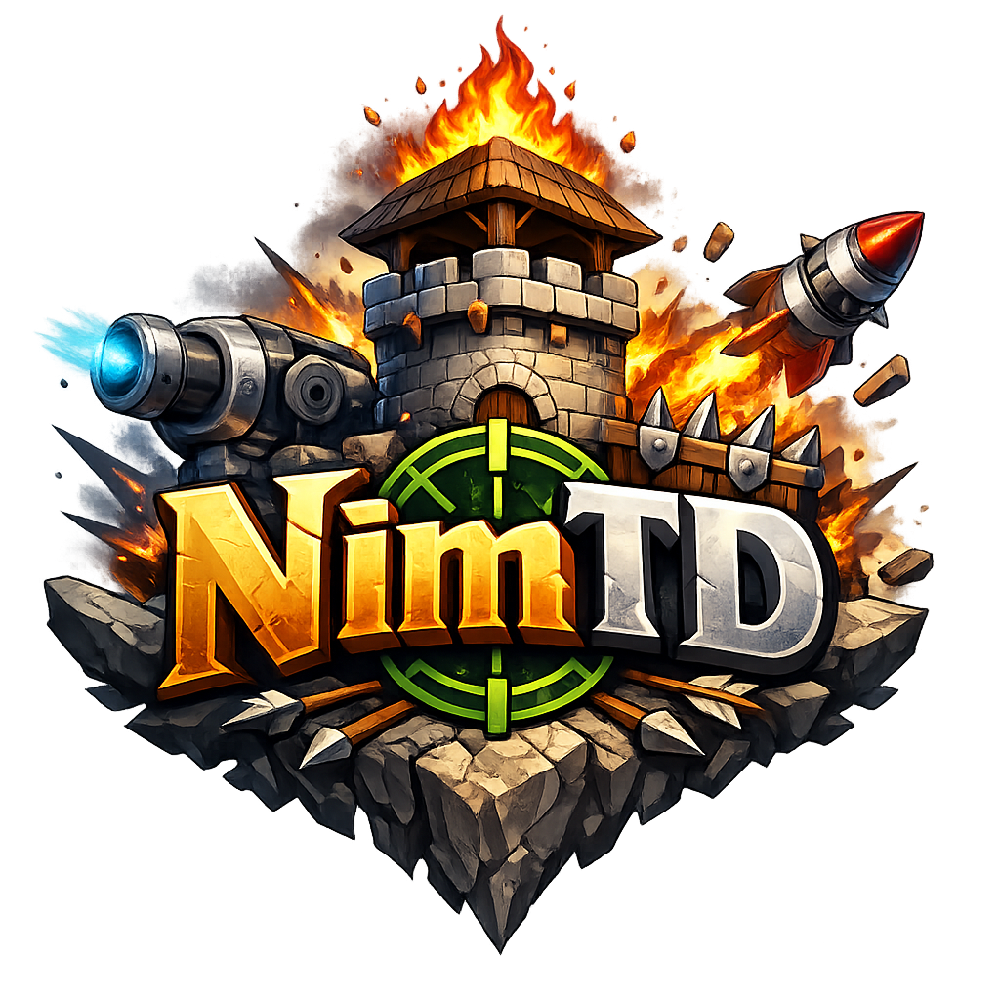

  

# NimTD

NimTD is a customizable pseudo-isometric tower-defense engine with an Electron desktop launcher, map editor, tower creator, and reusable mod files.

## Launch

1. Install [Node.js](https://nodejs.org/) if it is not already installed.
2. Run `launch.bat`.
3. The launcher installs Electron automatically on the first run, shows the NimTD splash screen, and opens the main menu.

## Features

- Play the default tower-defense map or load custom `.nimmaps` files.
- Build maps on grids from `5 x 5` to `100 x 100`.
- Paint paths, entry points, exits, blocked terrain, and buildable grass.
- Tune waves, economy values, spawn pacing, and game speed.
- Create custom towers with names, model styles, RGB colors, combat stats, and projectile prefabs.
- Use 25 tower model styles and expanded effects such as poison, web, piercing, radiation, gravity, laser, reflect, and summon.
- Save map mods locally and play-test them from the editor.

## Project Layout

- `index.html`: main menu.
- `game.html`: playable game shell.
- `editor.html`: map and tower editor.
- `electron-main.js`: Electron launcher, splash lifecycle, and map file bridge.
- `js/`: game engine, effects, tower definitions, editor logic, and menu logic.
- `maps/`: saved `.nimmaps` map files.
- `splash/`: splash screen, logo, and font assets.
- `default.nimmaps`: default playable map.

## Controls

- `WASD` or arrow keys: move the camera.
- Mouse wheel: zoom.
- Left click: place or select towers.
- Right click: cancel selection.
- `E`: open the map editor.
